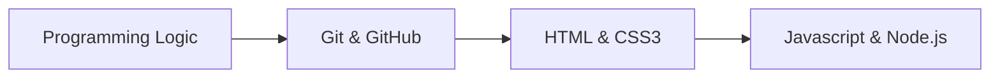

# Javascript Learning
---
Repo with all of my fisrt **javascript** codes writed while learning by myself.

Followed Guides:

* [Curso em vídeo - Gustavo Guanabara - PT-BR](https://www.youtube.com/watch?v=BXqUH86F-kA&list=PLntvgXM11X6pi7mW0O4ZmfUI1xDSIbmTm)
* [Programming With Mosh - ENG](https://www.youtube.com/watch?v=W6NZfCO5SIk)
* [Aaron Jack - ENG](https://www.youtube.com/watch?v=c-I5S_zTwAc)
* [Danki Code - PT-BR](https://www.youtube.com/watch?v=RvcRxEeJqi8)

# Recommended learning sequence

## Where am I going next?
- [ ] React
- [ ] React Native
- [ ] Vue.js
- [ ] PHP
- [ ] Go full Stack
